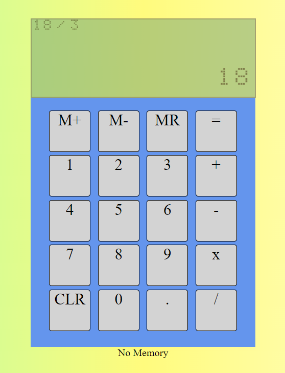

# Simple JS Calculator

### Task 6 in Software Development Mastermind

You can use it [here]()

### Summary

Task 6 in Andy Sterkowitz' Software Development Mastermind program involved creating a calculator with basic functionality. As a bonus, memory buttons are included to store, delete, and recall memory. This was a very difficult project for me, and for the level of developer I currently am, I found the logic to be quite complex. This is using vanilla JS with HTML/CSS. It took very complex dom manipulation methods in order to move the values around the screen properly, and a lot of conditional statements to ensure the proper variables were moved to the right place. I learned a ton from this project, and a personal goal of mine is to re-design it once I finish the Mastermind program.

### Author

* Elijah C Walker - Systems Engineer